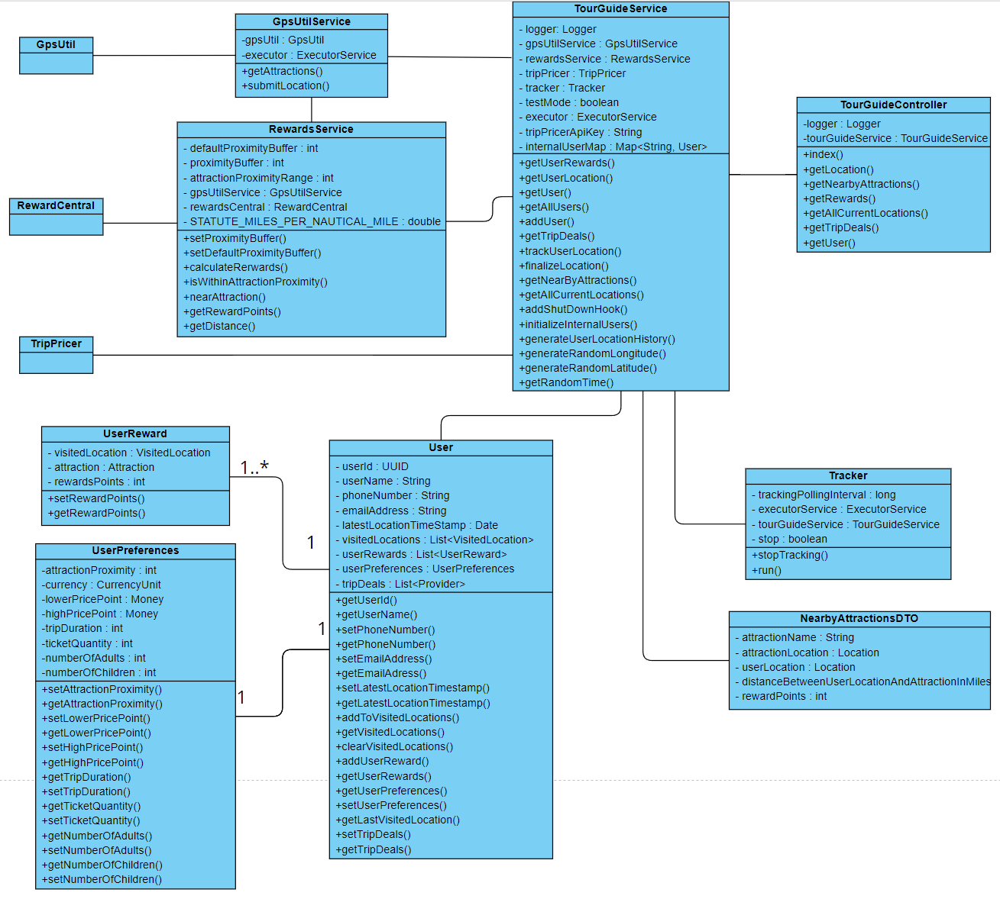
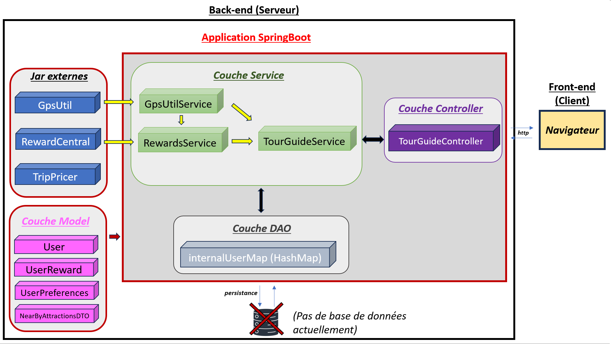

# TourGuide :

The world is your playground!

TourGuide is a Spring Boot application develop in Java and a centerpiece of the portfolio of the enterprise applications.

It allows users to see what are the nearby tourist attractions and get discounts on hotel stays as well as tickets to various shows. The application propose personalize tripdeals for users and a rewarding system when visiting attractions.

Available for all platforms (PC, tablets, phones)

-------------------------------------------------------------------------------------------------------------------------------------

## App Configuration :

- Java 8
- Gradle 4.8.1
- Spring Boot 2.1.6
- Gradle dependencies : (Lombok / Spring Web / Spring Actuator /Jacoco / Swagger)
- 3 external Jars (gpsUtil / RewardCentral / TripPricer)

- Server port 8080 : (http://localhost:8080) -> For the Greeting page

-------------------------------------------------------------------------------------------------------------------------------------

## Getting Started :

- Install Gradle
- Install Java

-> Clone project from Github on your local machine

-> Import project into your IDE and run application.java from there or go to the root of the application and execute "gradle bootRun"

-> When the server is running, you can use endpoints specified in TourGuideController class.

-> Tests can be run with Gradle

## API documentation with Swagger:

-While application in running on server, go to : "http://localhost:8080/swagger-ui.html" in order to see and test endpoints easily (you can use "internalUser0" as parameter for necessary endpoints).

-------------------------------------------------------------------------------------------------------------------------------------

## Class Diagram :

-------------------------------------------------------------------------------------------------------------------------------------

## Architectural Model:

-------------------------------------------------------------------------------------------------------------------------------------